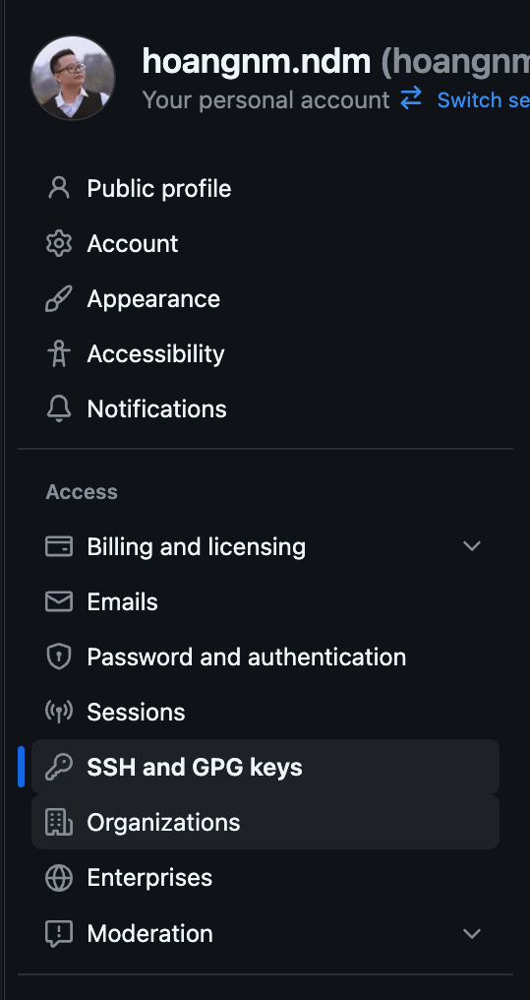

# Huong dan git

## Tạo tài khoản git

## Cài đặt git trên máy tính

Truy cập: https://git-scm.com/

- Tải và cài đặt.
- Kiểm tra cài đặt bằng lệnh:
  ```
  git --version
  ```

## Cấu hình git lần đầu

```bash
git config --global user.name "Your Name"
git config --global user.email "your email"
```

```bash
git config --list
```

## Cấu hình SSH key

SSH Key là một cặp khóa dùng để xác thực người dùng với máy chủ git (như GitHub, GitLab, Bitbucket) mà không cần sử dụng mật khẩu mỗi lần kết nối.

### Tạo SSH Key

```bash
ssh-keygen -t ed25519 -C "your_email@example.com"
```

Nếu bạn sử dụng hệ thống cũ không hỗ trợ ed25519, bạn có thể sử dụng rsa:

```bash
ssh-keygen -t -C "your_email@example.com"
```

Nhấn Enter để chấp nhận vị trí lưu mặc định. Sau đó, bạn có thể đặt mật khẩu bảo vệ cho khóa (khuyến nghị).

### Thêm SSH Key vào ssh-agent

Mở nội dung trong file `id_ed25519.pub` (hoặc `id_rsa.pub` nếu bạn sử dụng rsa) và sao chép toàn bộ nội dung.

Mở tài khoản github của bạn, vào phần Settings > SSH and GPG keys > New SSH key, dán nội dung đã sao chép vào và lưu lại.



## Bắt đầu với git

### Tạo repository mới

- Tại folder gốc của dự án:
  (initialize git repository)

```bash
git init
```

```bash
git add .
```

```bash
git commit -m "Initial commit"
```

### Kết nối với repository từ xa

- Tạo 1 repository trống ở trên github/gitlab/bitbucket
